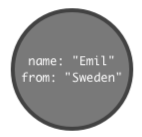
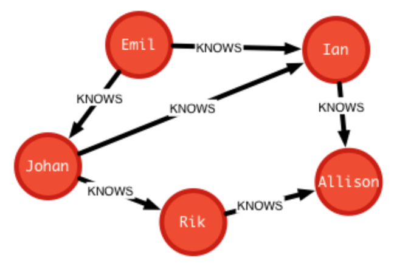

## Graph Databases and neo4j

---

##### Graph Databases

Graph databases emphasize the relationships between entities. 

Some types of relationships are difficult for *relational* databases, such as many-to-many relationships, and require additional, sometimes wasteful, tables to implement. Additionally, queries that require lots of joins are complex and hard to read.

Graph database model relationships more naturally. They also excel at *walking* relationships when the structure of those relationships forms an arbitrary graph.

---

##### Friend Network

Consider implementing a friend network application in an RDBMS. You might create the following two tables :

| Friend  |
| ------- |
| Alex    |
| Betty   |
| Charlie |
| Doogie  |
| Ephram  |

| Friend  | HasFriend |
| ------- | --------- |
| Alex    | Betty     |
| Charles | Doogie    |
| Betty   | Charlie   |
| Betty   | Ephram    |
| Doogie  | Ephram    |

Since relationships are two-way in nature, you can assume that the reverse of each relationship is in the table as well, doubling its row count. This does not seem efficient, and is a limitation of relational databases.

---

##### Joins for Friend Network

Imagine you decided to create the following query :

* Find all friends of Doogie

This is not very difficult. Now try to create a more complex query :

* Find all friends of friends of Doogie

Queries start to resemble fundamental problems in graph theory :

* How many degrees of seperation are there between Doogie and Betty?

---

##### Property Graph Model

* A *property graph* is made of *nodes*, *relationships*, and  *properties*.
* Nodes store properties as key/value pairs. Keys are strings.
* Relationships connected nodes. They have a direction and a label.
* Relationships also have properties just as nodes.

Note that this is a schema-free model. Nodes may be labeled with a *type*, but it does not determine their property list. Any node can have any number of properties.

---

##### Node

* A node can be represented graphically with a circle containing properties (key *and* value)
* The node itself is not a value. It does not have a name or identity apart from its properties.
* A label (not shown) indicates a category of nodes. We might label the following node, **Person**. **Person** nodes can have unique properties.



---

##### Relationships

* Relationships have a direction
* Relationships have a type
* Relationships can have properties



---

##### Docker

neo4j has an official docker container.

```
docker run --name neo4j -p 7474:7474 -p 7687:7687 -v ~/neo4j/data:/data neo4j
```

Windows users shoul replace the ~ with the path to their desktop or home folder.

------

##### Bolt

* BUI (Browser User Interface) at localhost:7474
* The top of the Bolt interface allows one to type commands. Try :
  * :play intro
  * :play concepts
  * :play cypher
* :client commands (start with colon)
* Shift-Enter for multiline commands
* Control-Enter after a Query (server-side)

---

##### Cypher

* Declarative (like SQL)

```cypher
CREATE (ee:Person { name: "Emil", from: "Sweden", klout: 99 });
MATCH (ee:Person) WHERE ee.name = "Emil" RETURN ee;

CREATE (js:Person { name: "Johan", from: "Sweden", learn: "surfing" }),
(ir:Person { name: "Ian", from: "England", title: "author" }),
(rvb:Person { name: "Rik", from: "Belgium", pet: "Orval" }),
(ally:Person { name: "Allison", from: "California", hobby: "surfing" }),
(ee)-[:KNOWS {since: 2001}]->(js),(ee)-[:KNOWS {rating: 5}]->(ir),
(js)-[:KNOWS]->(ir),(js)-[:KNOWS]->(rvb),
(ir)-[:KNOWS]->(js),(ir)-[:KNOWS]->(ally),
(rvb)-[:KNOWS]->(ally)
```
* Complex filters
```cypher
MATCH (js:Person)-[:KNOWS]-()-[:KNOWS]-(surfer)
WHERE js.name = "Johan" AND surfer.hobby = "surfing"
RETURN DISTINCT surfer
```

---

##### Cypher Clauses

* START : Optional starting point in graph for a query

```cypher
START a=node:user(name='Michael')
```
* MATCH : Filters

```cypher
MATCH (a)-[:KNOWS]->(b)-[:KNOWS]->(c), (a)-[:KNOWS]->(c)
```

* RETURN : Return values (like a SELECT clause)

```cypher
RETURN b,c
```

* Others : WHERE, CREATE, CREATE UNIQUE, DELETE, SET, FOREACH, UNION, WITH
* Identifiers become temporary variables. Values are bound to them.
* name : type is a pattern

