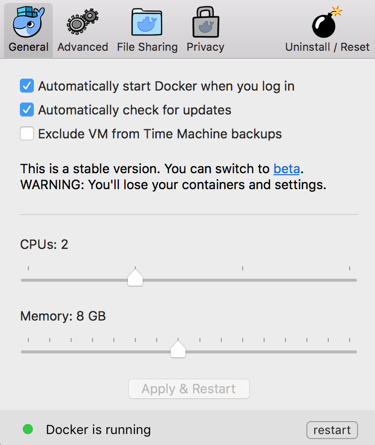
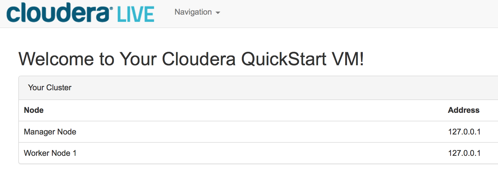
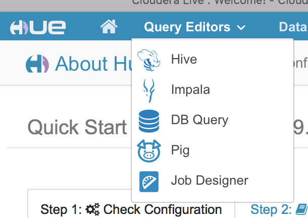

## Hadoop

---

##### Topics

* Hadoop
* Docker
* HDFS
* MapReduce
* Sqoop, Pig, Hive, Spark, related Tools

---

##### Hadoop

* Ecosystem of applications
* Open Source Apache Project
* Java-Based
* Maintained by Cloudera
* Started at Google
* Distributed Database that scales to 1000s of Processors

---

##### Core Hadoop

* HDFS distributes data across a network of mid-range powered servers **[low level]**
* Resource Management and Job Scheduling handled by word request. **[low level]**
* MapReduce processes data in-place (queries are distributed) **[mid level]**
* Pig, Hive, Mahout, and other tools provide data-mining and machine-learning frameworks for applications **[high level]**

---

##### Hadoop Processing Engines [high level] 

* Hive : Translates SQL (almost) into MapReduce
* Pig : Translates scripting language into MapReduce
* Impala : Low-latency parallel replacement for MapReduce to support transactional approach. (Cloudera)
* HBase : Another alternative to MapReduce
* Sqoop : Data-Scraping application (legacy —> hdfs)
* CDH : Cloudera Distribution (including) Hadoop / bundles many of these frameworks
* Hue : GUI for management

Download and install a Hadoop simulation (virtual nodes) using *Docker*.

```
docker pull cloudera/quickstart
docker images
```

This is a **HUGE** download (~7GB). Make room and be patient!

---

##### Hadoop Distributed Database

* Distributed databases provides parallelization and hardware redundancy
* Distributed means it runs on a *Cluster* of *Nodes*
* A Cluster is a centrally managed group of nodes
* Each Node is a commodity (cheap) server
* Nodes have dedicated roles (but can sometimes play multiple roles)
  * NameNode : Master role. Directory tree, tracks file locations (does not store them). Exclusive role.
  * JobTracker : Master role. Distributes MapReduce tasks to other nodes.
  * DataNode : Slave role. Stores data and replicated data.
    * Blocks can go anywhere!
  * TaskTracker : Slave role. Accepts tasks from JobTracker.
    * Nodes usually have DataNode and TaskTracker roles
* Nodes do not share storage physically or over the network.

---

##### Running Cloudera Quickstart

[Cloudera Quickstart Guide](https://hub.docker.com/r/cloudera/quickstart/)

First, increase Docker Memory :



* Run CDH in Docker:

```
docker run --name=hadoop --hostname=quickstart.cloudera --privileged=true -t -i -p 11001:80 -p 11002:7180 -p 11003:8888 cloudera/quickstart /usr/bin/docker-quickstart

🤖  ? docker ps
CONTAINER ID        IMAGE                 COMMAND                  CREATED             STATUS              PORTS                                                                     NAMES
1e7f372ef227        cloudera/quickstart   "/usr/bin/docker-quic"   8 minutes ago       Up 8 minutes        0.0.0.0:32770->80/tcp, 0.0.0.0:32769->7180/tcp, 0.0.0.0:32768->8888/tcp   hadoop

# Point your browser to localhost:11001/2/3 (try them all)
# GUI user/password are cloudera/cloudera
```



---

##### Docker Console Magic

* You can *log in* to a docker container and run comands, look at files
  * Learn some bash! [Bash Command Line Tutorial](http://lifehacker.com/5633909/who-needs-a-mouse-learn-to-use-the-command-line-for-almost-anything)
* The *docker run* command used for the **hadoop** container above leaves a command shell open because there is no **-d** (*detach*) option
* But you can *detach* from the container shell manually by hitting the special key Control-P followed by Control-Q, freeing your terminal for other activities.
* To get back to the container shell after detaching, run this command :

```
docker attach hadoop
```

* To start a *more command shells* on the container from *any terminal*, run this command :

```
docker exec -i -t hadoop /bin/bash
```

---

##### HDFS

* HDFS : Hadoop *Distributed* File System
* Files broken into blocks (64MB default) 
* Blocks distributed among Data Nodes

Try these commands on a Hadoop node :

```
hadoop fs -ls
echo DATA > someTextFile.txt
hadoop fs -put someTextFile.txt
hadoop fs -ls
hadoop fs -tail someTextFile.txt
hadoop fs -cat someTextFile.txt
hadoop fs -mv someTextFile.txt renamed.txt
hadoop fs -rm renamed.txt
```

Try these commands to create some customer data for queries later

```
[root@quickstart ~]# cd
[root@quickstart ~]# cat << EOF > custdata.txt
>  Myron     | Orlando   |       1001 | 2008-01-16
>  Leona     | Dunne     |       1002 | 2008-01-16
>  Kathy     | Smith     |       1003 | 2008-01-16
>  Leona     | Dunne     |       1004 | 2008-01-17
>  Anne      | Farriss   |       1005 | 2008-01-17
>  Myron     | Orlando   |       1006 | 2008-01-17
>  Amy       | O'Brian   |       1007 | 2008-01-17
>  Leona     | Dunne     |       1008 | 2008-01-17
> EOF
[root@quickstart ~]# hadoop fs -put custdata.txt
```

---

##### HDFS Redundancy

* Disk Failures
  * Data Node
    * Each block is replicated three times 
    * Distributed on random-ish nodes
  * Name Node
    * Raw data is meaningless without directory info
    * Redundancy : Active NameNode and StandBy NameNode
* Network Failures
  * Temporary outages

---

##### Queries : MapReduce

* Naturally parallelizable query framework
  * Parallelization replaces indexing (Hash,BTree) for performance
  * This approach actually *slower* for small jobs (relational is better)
  * … but is *faster* for very large jobs (analytic queries)
* Nodes play role of *Mappers* and *Reducers*
  * These are Daemons started by TaskTracker on Data Nodes
  * Prefer local blocks, but can stream from another node for load balance
* *Mapper* returns a Value for a given Key (Key/Value)
* Mapper —> *Shuffle/Sort* —> Reducer
* *Reducer* processes the data and returns a result

---

##### Mapper Example

* Hadoop feeds raw text data to your mapper code (through stdin)
* Mapper code must parse and return the interesting bits (throught stdout)

```python
#!/usr/bin/env python

import sys

def mapper():
	for line in sys.stdin:
		data = line.strip().split("|")
		firstname, lastname, invoice, date = data
		print "{0}\t{1}\t{2}".format(firstname,lastname,invoice)

mapper()
```

---

##### Reducer Example

```python
#!/usr/bin/env python

import sys

def reducer():
	count = 0
	oldfirstname = None
	oldlastname = None

	for line in sys.stdin:
		data = line.strip().split("\t")

		if len(data) != 3:
			continue

		firstname, lastname, invoice = data

		# Assume sorted input, check for name change
		if (oldfirstname and oldfirstname != firstname and
			oldlastname and oldlastname != lastname) :

			print "{0}\t{1}\t{2}".format(oldfirstname, oldlastname,
				count)

			count = 0

		oldfirstname = firstname
		oldlastname = lastname
		count = count + 1

	if (oldfirstname and oldlastname) :
		print "{0}\t{1}\t{2}".format(oldfirstname, oldlastname,
			count)

reducer()
```

---

##### Docker Host Integration Magic

* It would be nice to be able to actually copy and past the code above into Python files (*.py). You can certainly do this with your favorite editor, but how do we get files to the docker container?
* There is a way to share a folder between the host (your computer) and the docker container. It works great, but it does require us to remove the container and recreate it.
* Create or select a folder on your computer to share with the docker container. For me, it is ```/Users/mikejfromva/Desktop/DockerShare```. Stop and remove the container *hadoop*, then run it with this command :

```
docker run --name=hadoop --hostname=quickstart.cloudera --privileged=true -t -i -p 11001:80 -p 11002:7180 -p 11003:8888 -v /Users/mikejfromva/Desktop/DockerShare:/DockerShare cloudera/quickstart /usr/bin/docker-quickstart
```

* Now try ```ls /DockerShare``` from inside of the container

---

##### Executing MapReduce Queries

* The Hadoop Streaming interface allows us to use any language

```
hadoop jar /usr/lib/hadoop-0.20-mapreduce/contrib/streaming/hadoop-streaming-2.6.0-mr1-cdh5.7.0.jar -mapper mapper.py -reducer reducer.py -file mapper.py -file reducer.py -input custdata.txt -output custoutput

hadoop fs -ls custoutput

hadoop fs -cat custoutput/part-00000
```

* Congratulations! You executed a query.

---

##### MapReduce Design Patterns

* Filtering Pattern : Samples, Find top values
  * Simple Filters : Criteria, Random
  * Bloom Filter : Probabalistic Filter (Definite No / Maybe Yes)
* Summarization Pattern : Counting, min/max, statistics, indexing
  * Inverted Index : Book Index, Keywords -> Web Links
  * Numerical : Mean, Median, Mode, First, Last, Min, Max, Count
* Structural Pattern : Combining data sets

---

##### Example MapReduce Problem

* Correlate day-of-sale to money spent
* Mapper : Create (Day -> Money) Key,Value pair *only*
* Reducer : Do the math to find mean and standard deviation
  * Keep a running sum, sum^2 for variance

```python
K = 0
n = 0
ex = 0
ex2 = 0
 
def add_variable(x):
    if (n == 0):
      K = x
    n = n + 1
    ex += x - K
    ex2 += (x - K) * (x - K)
 
def remove_variable(x):
    n = n - 1
    ex -= (x - K)
    ex2 -= (x - K) * (x - K)
 
def get_meanvalue():
    return K + ex / n

def get_variance():
    return (ex2 - (ex*ex)/n) / (n-1)
```

[Algorithms on Variance](https://en.wikipedia.org/wiki/Algorithms_for_calculating_variance)

---

##### Sqoop

* Sqoop is a tool to harvest data from a SQL database (using SQL queries)
* In your hadoop container, try this command :

```
sqoop import-all-tables -m 1 --connect jdbc:mysql://quickstart.cloudera:3306/retail_db --username=retail_dba --password=cloudera --compression-codec=snappy --as-parquetfile --warehouse-dir=/user/hive/warehouse --hive-import
```

* There is a MySQL database running on the container.
  * NoSQL = *Not Only SQL*
* Sqoop connects to msyql and launches Hadoop queries that generate column data
  * Apache Parquet format
* Run this ```hadoop fs -ls /user/hive/warehouse``` to see the generated data
  * You should see a folder for each table. The database is a customer/order database like the one we studied in RDBMS.
  * Data is stored along with Metadata (table and column info)

---

##### Impala

* Impala is a SQL engine (high level) that works with certain formats of Hadoop data
* Optimized for interactive queries rather than large batch jobs
* Run an Impala query through Hue



* Import the metadata generated by the Sqoop run

```
invalidate metadata;

show tables;
```

* Try a query :

```sql
-- Most popular product categories
select c.category_name, count(order_item_quantity) as count
from order_items oi
inner join products p on oi.order_item_product_id = p.product_id
inner join categories c on c.category_id = p.product_category_id
group by c.category_name
order by count desc
limit 10;
```

---

##### Hive

- HiveQL is similar to SQL
- Converts SQL  to a series of map reduce jobs
- Log scraping is a popular application. We must first move the access logs over to HDFS.

```
hadoop fs -mkdir /user/hive/warehouse/original_access_logs
hadoop fs -copyFromLocal /opt/examples/log_files/access.log.2 /user/hive/warehouse/original_access_logs
```

* The following command creates a table-like schema for this text data.

```
CREATE EXTERNAL TABLE intermediate_access_logs (
    ip STRING,
    date STRING,
    method STRING,
    url STRING,
    http_version STRING,
    code1 STRING,
    code2 STRING,
    dash STRING,
    user_agent STRING)
ROW FORMAT SERDE 'org.apache.hadoop.hive.contrib.serde2.RegexSerDe'
WITH SERDEPROPERTIES (
    'input.regex' = '([^ ]*) - - \\[([^\\]]*)\\] "([^\ ]*) ([^\ ]*) ([^\ ]*)" (\\d*) (\\d*) "([^"]*)" "([^"]*)"',
    'output.format.string' = "%1$$s %2$$s %3$$s %4$$s %5$$s %6$$s %7$$s %8$$s %9$$s")
LOCATION '/user/hive/warehouse/original_access_logs';

```

* Hive stores schema data associated with the raw data, but the raw data stays in the access log, web page archive, etc.
* SERDE : Serializer/Deserializer. Takes unstructured text and turns it into semistructured text.
* Regular Expressions : Part of Data Science standard toolkit.
  * ( ) - Grouping. Referenced later as %1 (first group), %2 (second), %3, ...
  * [abc] - Inclusion Category. Wildcard matching any of these characters
  * [^abc] - Exclusion Category. Wildcard matching any *except* these characters.
  * []* - Star postfix operator matches *zero or more* characters from this category.
  * And much, much more
* We can move the text data into yet another text file, this time formatted in Parquet so that Impala can query it directly.

```
CREATE EXTERNAL TABLE tokenized_access_logs (
    ip STRING,
    date STRING,
    method STRING,
    url STRING,
    http_version STRING,
    code1 STRING,
    code2 STRING,
    dash STRING,
    user_agent STRING)
ROW FORMAT DELIMITED FIELDS TERMINATED BY ','
LOCATION '/user/hive/warehouse/tokenized_access_logs';

ADD JAR /usr/lib/hive/lib/hive-contrib.jar;

INSERT OVERWRITE TABLE tokenized_access_logs SELECT * FROM intermediate_access_logs;
```

* Now an Impala Query will work :

```
invalidate metadata;

select count(*),url from tokenized_access_logs
where url like '%\/product\/%'
group by url order by count(*) desc;
```

---

##### Pig

* Alternative to coding direct MapReduce programs
* Query Language : Pig Latin
* Open Source (many contributions)
* Support for Java, JavaScript, Python, Ruby, R(?)

Start ```pig -x local```

The shell prompt is ```grunt >```

1. Find total number of customers for each profession
2. Get the top ten customers from sales data and their full details

```grunt> cust = LOAD 'filename' using PigStorage(',') as (custid, fn, ln…)```

```grunt> describe cust;```

First step is to load that data into Pig environment.

Bring all of the professions together to count them.

```grunt> groupbyprof = GROUP cust BY profession;```

```grunt> countbyprof = FOREACH groupbyprof GENERATE group, count(cust);```

---

##### Pig Features

* Rich set of operators - join, sort, filter
* Ease of programming - Pig Latin is like SQL!
* Extensibility - Can develop your own functions


* Short queries eash for ad-hoc processing
* Handles huge data sets like web logs
* Handles semistructured data

---

##### Pig Query Execution

* Local Mode
* Map/Reduce Mode


* Grunt shell
* Script file
* Embedded Program

Operations: load, store, filter, distinct, foreach, generate, group, order

---

##### References

Practical Data Science with Hadoop® and Spark: Designing and Building Effective Analytics at Scale. By: Ofer Mendelevitch; Casey Stella; Douglas Eadline.

[Cloudera Docker Container](https://www.cloudera.com/documentation/enterprise/5-6-x/topics/quickstart_docker_container.html)

[Cloudera Tutorial](https://www.cloudera.com/developers/get-started-with-hadoop-tutorial.html)

[Hadoop](https://hadoop.apache.org)

