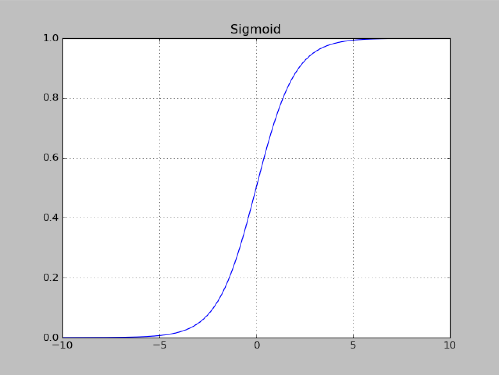
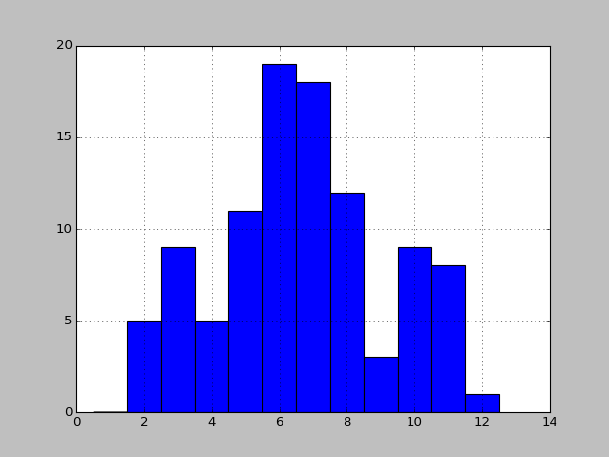

## Python for Data Science

---

##### Topics

* Data Science Languages
* Python
* Advanced Python
* Data Visualization

---

##### Popular Languages for Data Science

These features allow a developer to *play with data* interactively, gaining insight about the data set as you do so. Any language is viable for machine-learning or data analysis, but some languages are more popular in this field because of their history and features. Many of these languages express mathematical concepts like vectors and matrices more naturally than structured languages like Java, and they tend to emphasize a scripty interpreter model over classes and interfaces.

* R
  * Originally a statistical programming language
  * Everything has dimensions
  * Dynamically typed variables
  * Operators work on high level math objects (vectors, matrices)

```R
> x <- 1
> y <- 2
> x + y
[1] 3
> x <- c(1,2,3,4,5)
> mean(x)
[1] 3
> y <- x^2
> y
[1]  1  4  9 16 25
```

* Matlab (GNU Octave free alternative)
  * Very similar to R in capabilities
  * Using GNU Octave here

```octave
>> mymatrix = [2,3; -5,8]
mymatrix =

   2   3
  -5   8

>> eye(2)
ans =

Diagonal Matrix

   1   0
   0   1

>> augmented = [eye(2) mymatrix]
augmented =

   1   0   2   3
   0   1  -5   8

>> augmented(1,:) *= 1/2
augmented =

   0.50000   0.00000   1.00000   1.50000
   0.00000   1.00000  -5.00000   8.00000

>> augmented(2,:) += augmented(1,:) * 5
augmented =

    0.50000    0.00000    1.00000    1.50000
    2.50000    1.00000    0.00000   15.50000

>> augmented(2,:) /= 15.5
augmented =

   0.50000   0.00000   1.00000   1.50000
   0.16129   0.06452   0.00000   1.00000

>> augmented(1,:) -= augmented(2,:) * 1.5
augmented =

   0.25806  -0.09677   1.00000   0.00000
   0.16129   0.06452   0.00000   1.00000

>> myinverse = augmented(:,1:2)
myinverse =

   0.258065  -0.096774
   0.161290   0.064516

>> myinverse * mymatrix
ans =

   1   0
   0   1

>> mymatrix * myinverse
ans =

   1   0
   0   1
```

* Python
  * A favorite of scientists and data scientists
  * Not as mathematical as R, Matlab, or Octave
  * Gains some mathyness through operator overloads

```python
>>> A = [ [1,2,3], [4,5,6] ]
>>> B = [ [1,2], [3,4], [5,6] ]
>>> A
[[1, 2, 3], [4, 5, 6]]
>>> B
[[1, 2], [3, 4], [5, 6]]
>>> A * B
# Traceback (most recent call last):
#   File "<stdin>", line 1, in <module>
# TypeError: can't multiply sequence by non-int of type 'list'
>>> import numpy as np
>>> A = np.matrix(A)
>>> B = np.matrix(B)
>>> A
matrix([[1, 2, 3],
        [4, 5, 6]])
>>> B
matrix([[1, 2],
        [3, 4],
        [5, 6]])
>>> A * B
matrix([[22, 28],
        [49, 64]])
```

* Scala
  * Drastic departure from others on this list
  * Functional, favors lambdas and constants
  * Compiles into JVM (Requires Java installation) or .NET (Windows)
  * Not as *verbose* as Java
  * Static typed (others on this list are dynamic)
  * Heavily used in Spark (in-memory cluster database by Apache)

```scala
def isGoodEnough(guess: Double, x: Double) = {
  math.abs(guess * guess - x) / x < 0.0001
}

def improve(guess: Double, x: Double): Double = {
  (guess + x / guess) / 2
}
def sqrtIter(guess: Double, x: Double): Double = {
  if (isGoodEnough(guess, x)) guess
  else sqrtIter(improve(guess, x), x)
}

def sqrt(x: Double): Double = {
  sqrtIter(1.0, x)
}

scala> sqrt(1)
res0: Double = 1.0

scala> sqrt(2)
res1: Double = 1.4142156862745097

scala> sqrt(9)
res2: Double = 3.00009155413138
```

---

##### Python Basics

* Dynamically typed
* No variable declaration (reduces **null** values)
* Operators heavily overloaded
* Tabs instead of {curly braces}
* Main collection types
  * Immutable tuple (1,2,3)
  * Mutable list [1,2,3]
  * Dictionary {"one":1}
* ***Huge*** differences between Python 2 and Python 3. Broke compatibility. Watch for versions.

```python
# lists
myList=[]
myList.append('Arthur')
myList.append('Robin')
myList.append('Bryan')
myList.append('Arthur')
myList = myList + ['Galahad']

print(','.join(myList))

# sets
mySet=set(myList)

print(mySet)

# dictionary
myDictionary={}
myDictionary['VA']='Virginia'
myDictionary['IA']='Iowa'

# Exception
try:
    print(myDictionary['DE'])
except:
    pass

# "None"
###print(myDictionary('DE'))

print(myDictionary.setdefault('DE','Delaware'))
print(myDictionary['DE'])

# tuples (immutable)
myTuple = ('one','two','three')

# handy functions
myList.sort()
myList.reverse()

print(myList)

# importing modules
import math,random,sys,os,importlib,glob

# list comprehension
PowersOfTwo = [i**2 for i in range(16)]

# iterator
longRange=range(10000000000000000000000000000000000000000000000000000)
longRangeIter=iter(longRange)
m = map(math.cos, longRangeIter)
print(next(m))
print(next(m))
print(next(m))

# function definitions
def square(x):
    return x*x

# default value
def fib(n=-1):
    a,b = 1,1
    for i in range(n):
        a,b = b,a+b
    return a

print(fib(10))

# multiple args
def pr(*args):
    print(','.join(args))

pr("Hello",'World!')

# keywords for named parameters
def grav(**kwds):
    return 6.67e-11*kwds['mass']/(kwds['dist']**2)

print(grav(mass=7,dist=2))
print(grav(mass=14,dist=4))

def flexOps(x,y):
    return x+y

print(flexOps(1,2)) # Print understands integers
print(flexOps('a','b'))

print([5,6]*7)
```

---

##### Classes & Objects

* Classes and objects are intrinsic to modern application development
* They seem wedged into Python

```python
class animal():
    count = 0
    def __init__(self,name):
        self.name = name
        animal.count = animal.count + 1

class dog(animal):
    count = 0
    def __init__(self,name,master):
        super().__init__(name)
        dog.count = dog.count+1
        self.master = master
        self.tricks=set()

    def learnTrick(self,trick):
        self.tricks.add(trick)
        # ADD to sets, APPEND to lists
```

* Dunderbar is a *code smell*. It says, "I chose this name to make the compilation work, not to be expressive" (dunderbar = __)

---

##### Duck Typing

* Classes and objects may have new fields and methods dynamically assigned to them at runtime

```python
class duck:
    def quack(self):
        print("QUACK!")
        
class cat:
    def meow(self):
        print("MEOW!")
        
aduck = duck()
maple = cat()
licorice = cat()

aduck.quack()
maple.meow()
licorice.meow()

# Giving an OBJECT a new method
maple.quack = duck.quack
maple.quack(maple) # Needs "self"

# Giving a CLASS a new method
duck.meow = cat.meow
aduck.meow()
```

---

##### Objects and References

* Everything is an object (no primitives)
* Every variable is a reference

```python
# Lots of Monty PYTHON references here. Get it???
x = [ 'Sir', 'Arthur', 'King', 'Person']
x.append('KCHnnnnnnniggets')
print(x)

y = ['Ham', 'Eggs', 'Sausage', 'Bacon', x]
print(y)

x = x + ['Your mother was a HAMPSTER']
print('x is a new object')
print(x)
print('but y contains a reference to the original object x used to point to')
print(y)
```

---

##### Strings

```python
# Unicode
>>> ord('z')
122
>>> ord('😍')
128525
>>> 'I took my {0} to the {1} for some {2}.'.format('Dog','doctor','shots')
'I took my Dog to the doctor for some shots.'
```

---

##### Lambdas

```python
>>> y = lambda x : x**2
>>> y(3)
9
>>> y(4)
16
>>> ind = [1,2,3,4,5]
>>> map(y,ind)
<map object at 0x1137b4e48>
# Returns an iterator, not a list
>>> list(map(y,ind))
[1, 4, 9, 16, 25]
# Also filter and reduce..
```

---

##### List Comprehensions

```python
>>> x = [4, 1, 3, 2]
>>> y = sorted(x)
>>> x
[4, 1, 3, 2]
>>> y
[1, 2, 3, 4]
>>> x.sort()
>>> x
[1, 2, 3, 4]

>>> naturals = [x for x in range(10)]
>>> naturals
[0, 1, 2, 3, 4, 5, 6, 7, 8, 9]
>>> evens = [x for x in naturals if x%2==0]
>>> evens
[0, 2, 4, 6, 8]
>>> odds = [x for x in naturals if x%2==1]
>>> odds
[1, 3, 5, 7, 9]
>>> pairs = [(x,y) for x in range(3) for y in range(5,7)]
>>> pairs
[(0, 5), (0, 6), (1, 5), (1, 6), (2, 5), (2, 6)]
```

---

##### Generators and Iterating

* lazy evaluation
* ranges are generators
* **yield** keyword creates a generator

```python
def doubles(n):
    i = 1
    while i <= n:
        yield i
        i *= 2

>>> [x for x in doubles(100)]
[1, 2, 4, 8, 16, 32, 64]
```

---

##### Randomness

```python
>>> rand.seed(10)
>>> rand.randrange(5,10)
9
>>> rand.random()
0.032585065282054626

>>> shuffleMe = list(range(10))
>>> rand.shuffle(shuffleMe)
>>> shuffleMe
[0, 5, 1, 9, 4, 6, 7, 3, 2, 8]
```

---

##### Regular Expressions

* Important for log scraping, web scraping
* [Online RegEx Tester](https://regex101.com)
* [Regex GAME (Do this! FUN!)](https://regexcrossword.com)

```python
>>> novel = """
... It was a dark and stormy night. Suddenly, a shot rang out!
... A door slammed. The maid screamed.
... Suddenly, a pirate ship appeared on the horizon!
... While millions of people were starving, the king lived in
... luxury. Meanwhile, on a small farm in Kansas, a boy was
... growing up.
... """
>>> import re
>>> re.findall('\w+',novel)
['It', 'was', 'a', 'dark', 'and', 'stormy', 'night', 'Suddenly', 'a', 'shot', 'rang', 'out', 'A', 'door', 'slammed', 'The', 'maid', 'screamed', 'Suddenly', 'a', 'pirate', 'ship', 'appeared', 'on', 'the', 'horizon', 'While', 'millions', 'of', 'people', 'were', 'starving', 'the', 'king', 'lived', 'in', 'luxury', 'Meanwhile', 'on', 'a', 'small', 'farm', 'in', 'Kansas', 'a', 'boy', 'was', 'growing', 'up']
>>> for i,word in enumerate(re.findall('\w+',novel)):
...     print(i,word)
... 
0 It
1 was
2 a
...
```

---

##### Packing and Unpacking

```python
>>> list1 = ['a','b','c']
>>> list2 = [1,2,3]
>>> newlist = list1
>>> newlist # Reference. I want a copy!
['a', 'b', 'c']
>>> newlist = [list1] # First attempt to copy...
>>> newlist
[['a', 'b', 'c']]
>>> newlist = [*list1] # Unpacked. Works this time.
>>> newlist
['a', 'b', 'c']
>>> len(list1)
3
>>> len(list2)
3
>>> list(zip(list1,list2))
[('a', 1), ('b', 2), ('c', 3)]
```

---

##### Matplotlib

```python
import numpy as numpy
import matplotlib.pyplot as plot

x = numpy.arange(-10, 10, 0.01)

def sigmoid(x):
        return 1/(1+numpy.exp(-x))


#plot.plot(x, nonlinear(x))

plot.plot(x, sigmoid(x))
plot.title('Sigmoid')
plot.grid(True)
plot.show()
```



[Matplotlib Howto](http://matplotlib.org/users/pyplot_tutorial.html)

---

##### Statistics

```python
from matplotlib import pyplot as plot

# 101 dice rolls
dicerolls = [random.randint(1,6) + random.randint(1,6) 
    for x in range(100)]
                
plot.hist(dicerolls, bins=[x+0.5 for x in range(13)])
plot.grid(True)
```



```python
>>> import statistics as stats
>>> stats.mean(dicerolls)
6.65
>>> stats.median(dicerolls)
7.0
>>> stats.variance(dicerolls)
6.290404040404041
>>> stats.stdev(dicerolls)
2.5080677902329596
```

---

##### Probability

Testing math formatting!

$$
P(E,F) = P(E)P(F)
$$

More math to come in a separate document...
